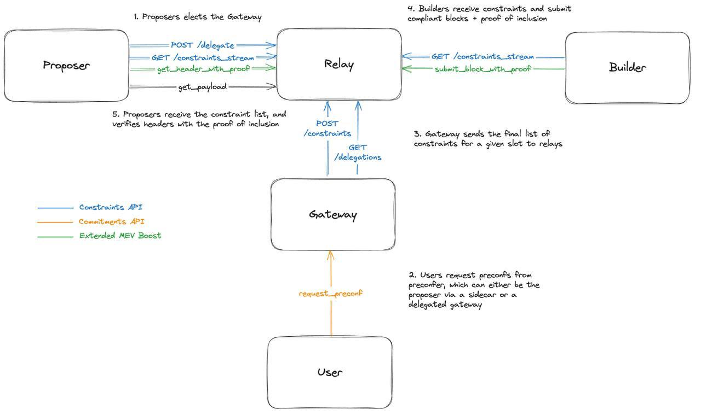
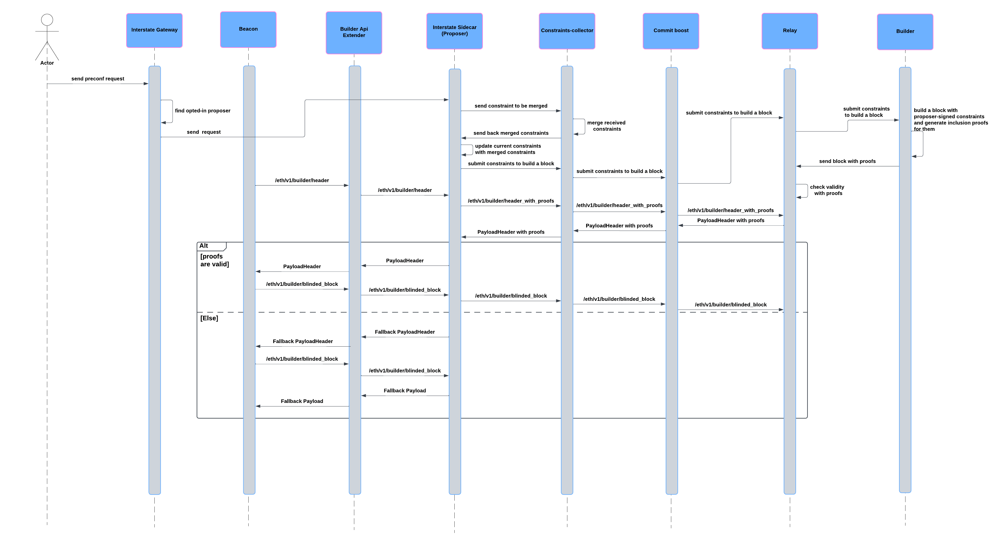

[](docs.interstate.so)
[]([https://t.me/+Pcs9bykxK3BiMzk5](https://t.me/+-i4dP7U2BggxMzAx))
[](https://x.com/interstatefdn)

# Interstate Sidecar To Enable Continous Transaction Execution on Mainnet.
Interstate is an extension to the PBS / MEV-Boost pipeline which enables instant and continuous transaction preconfirmations on mainnet, this is a massive UX improvement for Ethereum. 



Interstate's design optionally allows multiple preconfirmations sidecars to run on the same validator. This design promotes decentralization: https://docs.interstate.so/research/multiparty-preconf. This is still in development and the single sidecar setup is ready and recommended for now.

## How it works



## How to install
`
git clone https://github.com/interstate-labs/proposer-commitment-network.git
cd proposer-commitment-network
`

## Using cargo
`
cargo build
cargo run
`

# Preconfirmation request RPC interface
## Endpoint
`{SIDECAR_URL}/api/v1/preconfirmation`
## Method
`Post`
## Headers
`Content-Type:application/json`
## Body
```
{
  tx: signed raw transaction,
  slot: target slot number,
  sender: signer address
}
```
## Response
`ok:true`
